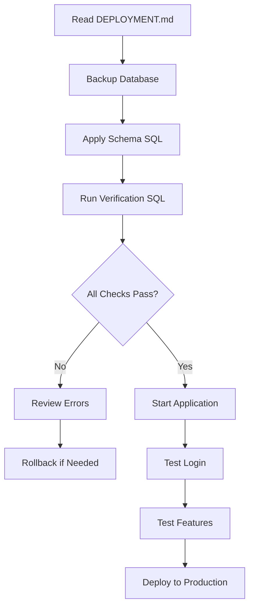

# 📦 Implementation Summary - Konark HRM Schema Deployment

## ✅ What Has Been Completed

All code changes and documentation have been prepared for deploying the Konark HRM database schema (v1.2) to your Supabase instance.

---

## 📂 Files Created

### 1. Application Code

| File | Description | Status |
|------|-------------|--------|
| [`services/auth.ts`](services/auth.ts) | New authentication service with database-backed login | ✅ Created |
| [`.env.local`](.env.local) | Environment configuration with Supabase credentials | ✅ Created |

### 2. Database Scripts

| File | Description | Status |
|------|-------------|--------|
| [`database/schema.sql`](database/schema.sql) | Complete database schema (already exists) | ✅ Ready |
| [`database/backup-current-db.sql`](database/backup-current-db.sql) | Backup script to run before deployment | ✅ Created |
| [`database/verify-schema.sql`](database/verify-schema.sql) | Comprehensive verification queries | ✅ Created |

### 3. Documentation

| File | Description | Status |
|------|-------------|--------|
| [`DEPLOYMENT.md`](DEPLOYMENT.md) | Step-by-step deployment guide | ✅ Created |
| [`plans/database-deployment-plan.md`](plans/database-deployment-plan.md) | Complete technical architecture plan | ✅ Created |
| [`plans/implementation-checklist.md`](plans/implementation-checklist.md) | 22-step executable checklist | ✅ Created |
| [`plans/quick-reference.md`](plans/quick-reference.md) | Quick reference guide | ✅ Created |
| [`README.md`](README.md) | Updated with deployment info | ✅ Updated |

---

## 📝 Files Modified

| File | Changes | Status |
|------|---------|--------|
| [`context/AuthContext.tsx`](context/AuthContext.tsx) | Updated `loginHR()` function to use database authentication (line 40-57) | ✅ Modified |

---

## 🚀 Ready to Deploy

### Next Steps (In Order)

#### 1️⃣ Backup Current Database (5 minutes)
```bash
# Open Supabase Dashboard → SQL Editor
# Run: database/backup-current-db.sql
```

#### 2️⃣ Apply New Schema (2 minutes)
```bash
# In Supabase SQL Editor
# Run: database/schema.sql (entire file)
```

#### 3️⃣ Verify Deployment (3 minutes)
```bash
# In Supabase SQL Editor
# Run: database/verify-schema.sql
```

#### 4️⃣ Test Application (5 minutes)
```bash
# Start dev server
npm install  # If not done already
npm run dev

# Login with:
# Email: admin@konark.com
# Password: admin123
```

**Total Time**: ~15 minutes

---

## 🔑 Key Changes Implemented

### Authentication Flow

**Before** (Mock):
```typescript
// Hardcoded password check
if (pass !== 'admin123') throw new Error('Invalid Credentials');
```

**After** (Database):
```typescript
// Real database authentication with bcrypt
const result = await authenticateHR(email, password);
// Calls hr_login() RPC function
// - Verifies password hash
// - Tracks failed attempts
// - Creates session token
// - Logs to audit trail
```

### Security Enhancements

| Feature | Implementation |
|---------|----------------|
| **Password Hashing** | Bcrypt via pgcrypto extension |
| **Session Tokens** | 8-hour expiry, stored in `hr_sessions` table |
| **Account Lockout** | Auto-lock after 5 failed attempts (15 min) |
| **Audit Logging** | All login attempts logged to `audit_logs` |
| **Failed Attempts** | Tracked in `users.failed_login_attempts` |

---

## 📊 Database Schema Overview

### Tables Created (7 total)

```
users              → HR Admin accounts
employees          → Worker records with UAN
sites              → Work locations
salary_records     → Monthly payroll data
companies          → Company branding
hr_sessions        → Session tokens
audit_logs         → Complete audit trail
```

### Functions Created (7 total)

```
hr_login()                                  → Authenticate HR admin
upsert_employee()                           → Create/update employee
upsert_salary()                            → Create/update salary record
write_audit_log()                          → Log database operations
touch_updated_at()                         → Update timestamps
refresh_site_employee_count()              → Recalculate employee counts
sync_site_counts_from_employee_change()    → Auto-sync on employee changes
```

### Triggers Created (6 total)

```
All tables          → Auto-update updated_at timestamp
employees table     → Auto-sync site employee counts
```

---

## 🧪 Testing Checklist

After deployment, verify:

- [ ] HR Admin login works (`admin@konark.com` / `admin123`)
- [ ] Session token created in `hr_sessions` table
- [ ] Failed login attempts tracked
- [ ] Account locks after 5 failed attempts
- [ ] Employee creation works via UI
- [ ] Employee approval/rejection works
- [ ] Site employee counts update automatically
- [ ] Audit logs capturing all actions

---

## ⚠️ Important Notes

### Data Safety
- **CRITICAL**: Run [`database/backup-current-db.sql`](database/backup-current-db.sql) BEFORE applying schema
- The schema script **DROPS all existing tables** (line 11-22 in schema.sql)
- Backups are stored as `backup_20260211_*` tables

### Default Credentials
- **Email**: `admin@konark.com`
- **Password**: `admin123`
- Change immediately after first login (or update in database)

### RLS Policies
- Currently set to **development mode** (permissive)
- All authenticated users have full access
- Production hardening documented in deployment plan

### Session Duration
- Default: 8 hours
- Configurable in schema.sql (line 133): `now() + interval '8 hours'`

---

## 🔧 Configuration

### Environment Variables
Already configured in [`.env.local`](.env.local):
```env
VITE_SUPABASE_URL=https://aqfcbijhvdbwlqrvmrxa.supabase.co
VITE_SUPABASE_ANON_KEY=sb_publishable_uYPotcTGMSAcM4BgDPN_HQ_KyE-fFYg
```

### Supabase Connection
Existing connection in [`services/supabase.ts`](services/supabase.ts) works as-is, no changes needed.

---

## 📚 Documentation Links

| Document | Purpose | When to Use |
|----------|---------|-------------|
| [`DEPLOYMENT.md`](DEPLOYMENT.md) | Main deployment guide | **Start here** for step-by-step deployment |
| [`plans/database-deployment-plan.md`](plans/database-deployment-plan.md) | Technical architecture | Understand full system design |
| [`plans/implementation-checklist.md`](plans/implementation-checklist.md) | Detailed checklist | Follow during deployment |
| [`plans/quick-reference.md`](plans/quick-reference.md) | Quick commands | Reference for common tasks |
| [`README.md`](README.md) | Project overview | Share with team |

---

## 🚨 Troubleshooting

### If Deployment Fails

**Rollback Procedure**:
```sql
-- In Supabase SQL Editor
DROP SCHEMA public CASCADE;
CREATE SCHEMA public;

-- Restore from backups
CREATE TABLE companies AS SELECT * FROM backup_20260211_companies;
CREATE TABLE sites AS SELECT * FROM backup_20260211_sites;
CREATE TABLE employees AS SELECT * FROM backup_20260211_employees;
CREATE TABLE salary_records AS SELECT * FROM backup_20260211_salary_records;
```

### If Login Fails

**Reset admin password**:
```sql
UPDATE users 
SET password_hash = crypt('admin123', gen_salt('bf')),
    failed_login_attempts = 0,
    locked_until = NULL
WHERE email = 'admin@konark.com';
```

### If Account Locked

**Unlock manually**:
```sql
UPDATE users 
SET locked_until = NULL, 
    failed_login_attempts = 0 
WHERE email = 'admin@konark.com';
```

---

## 💡 Deployment Workflow Diagram



---

## ✨ What's New in v1.2

### Security Features
- ✅ Bcrypt password hashing
- ✅ Session token management
- ✅ Failed login tracking
- ✅ Automatic account lockout
- ✅ Comprehensive audit logging

### Database Enhancements
- ✅ RPC functions for secure operations
- ✅ Automatic triggers for data consistency
- ✅ Row Level Security (RLS) policies
- ✅ Performance indexes

### Developer Experience
- ✅ Complete TypeScript typing
- ✅ Centralized authentication service
- ✅ Environment-based configuration
- ✅ Comprehensive documentation

---

## 🎯 Success Metrics

After deployment, you should achieve:

| Metric | Target | Verification |
|--------|--------|--------------|
| Schema Deployment | 100% success | Run verify-schema.sql |
| Authentication | Working | Login as admin@konark.com |
| Session Management | Active | Check hr_sessions table |
| Audit Logging | Enabled | Check audit_logs table |
| Triggers | Functional | Create/update employee |
| Application | Operational | All pages load |

---

## 📞 Support Resources

- **Deployment Issues**: See [`DEPLOYMENT.md`](DEPLOYMENT.md) troubleshooting
- **Schema Questions**: Review [`plans/database-deployment-plan.md`](plans/database-deployment-plan.md)
- **Quick Fixes**: Check [`plans/quick-reference.md`](plans/quick-reference.md)
- **Code Changes**: See [`services/auth.ts`](services/auth.ts) and [`context/AuthContext.tsx`](context/AuthContext.tsx)

---

## 🎉 Ready to Deploy!

All preparation is complete. Follow the deployment guide in [`DEPLOYMENT.md`](DEPLOYMENT.md) to apply the schema to your Supabase database.

**Recommended Order**:
1. Read [`DEPLOYMENT.md`](DEPLOYMENT.md) sections 1-3
2. Create backups
3. Apply schema
4. Verify deployment
5. Test application

---

**Implementation Date**: 2026-02-11  
**Schema Version**: v1.2  
**Status**: ✅ Ready for Deployment  
**Documentation**: Complete
