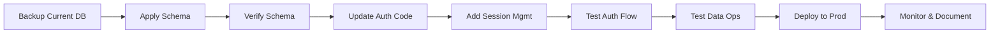

# Konark HR & Salary Management System - Database Deployment Plan

## Overview
This plan outlines the steps to apply the complete database schema to your Supabase PostgreSQL instance and integrate real database authentication into the application.

## Current State Analysis

### Application Architecture
- **Frontend**: React + TypeScript + Vite
- **Backend**: Supabase (PostgreSQL)
- **Authentication**: Currently using mock authentication with hardcoded credentials
- **Current Supabase URL**: `https://aqfcbijhvdbwlqrvmrxa.supabase.co`

### Schema Comparison

#### Current Schema (database/schema.sql - Version 1.2)
The new schema includes comprehensive security and audit features:

**Core Tables**:
- [`users`](database/schema.sql:23) - HR Admin accounts with password hashing
- [`sites`](database/schema.sql:31) - Work locations/sites
- [`employees`](database/schema.sql:42) - Employee records with UAN
- [`salary_records`](database/schema.sql:56) - Payroll data
- [`companies`](database/schema.sql:68) - Company profile/branding
- [`audit_logs`](database/schema.sql:79) - Audit trail
- [`hr_sessions`](database/schema.sql:87) - Session management

**Key Features**:
- Password hashing using pgcrypto (bcrypt)
- Session-based authentication with token expiry
- Failed login attempt tracking with account lockout
- Comprehensive audit logging
- Row Level Security (RLS) policies
- Automatic timestamp updates via triggers
- Employee count synchronization triggers

### Critical Differences from Current Mock Implementation

#### Authentication Changes Needed:
1. **Current**: Hardcoded password check `if (pass !== 'admin123')`
2. **New**: Database function [`hr_login()`](database/schema.sql:106) with bcrypt verification
3. **Session Management**: New table [`hr_sessions`](database/schema.sql:87) for token-based auth

## Deployment Strategy

### Phase 1: Pre-Deployment Preparation

#### 1.1 Backup Current Database
```sql
-- Run in Supabase SQL Editor before applying schema
-- Create backup tables with timestamp
CREATE TABLE IF NOT EXISTS backup_20260211_companies AS SELECT * FROM companies;
CREATE TABLE IF NOT EXISTS backup_20260211_sites AS SELECT * FROM sites;
CREATE TABLE IF NOT EXISTS backup_20260211_employees AS SELECT * FROM employees;
CREATE TABLE IF NOT EXISTS backup_20260211_salary_records AS SELECT * FROM salary_records;
```

#### 1.2 Document Current Data
- Export current tables to CSV/JSON for reference
- Document any custom data that needs migration
- Take screenshots of current application state

### Phase 2: Schema Deployment

#### 2.1 Apply Complete Schema
The schema in [`database/schema.sql`](database/schema.sql:1) will:
- **DROP** all existing tables (line 11-22)
- **CREATE** new tables with enhanced security (line 23-87)
- **CREATE** functions and triggers (line 92-139)
- **CREATE** indexes for performance (line 179-186)
- **ENABLE** Row Level Security (line 191-207)
- **INSERT** seed data (line 212-219)

**Execution Method**:
```bash
# Option A: Via Supabase Dashboard
1. Go to SQL Editor in Supabase Dashboard
2. Create new query
3. Copy entire contents of database/schema.sql
4. Click "Run" button

# Option B: Via Supabase CLI (if installed)
supabase db push
```

#### 2.2 Verify Schema Application

**Verification Checklist**:

```sql
-- 1. Check all tables exist
SELECT table_name FROM information_schema.tables 
WHERE table_schema = 'public' 
ORDER BY table_name;
-- Expected: audit_logs, companies, employees, hr_sessions, salary_records, sites, users

-- 2. Check enums created
SELECT typname FROM pg_type WHERE typtype = 'e';
-- Expected: user_role, employee_status, record_status

-- 3. Check functions exist
SELECT proname FROM pg_proc 
WHERE pronamespace = 'public'::regnamespace;
-- Expected: hr_login, upsert_employee, upsert_salary, write_audit_log, etc.

-- 4. Check triggers exist
SELECT trigger_name, event_object_table 
FROM information_schema.triggers 
WHERE trigger_schema = 'public';
-- Expected: trg_touch_updated_at on multiple tables, trg_sync_site_counts_from_employee_change

-- 5. Check RLS policies
SELECT tablename, policyname 
FROM pg_policies 
WHERE schemaname = 'public';
-- Expected: *_dev_all policies on all main tables

-- 6. Verify seed data
SELECT * FROM users WHERE email = 'admin@konark.com';
SELECT * FROM companies LIMIT 1;
```

### Phase 3: Application Integration

#### 3.1 Update Authentication Context

**File**: [`context/AuthContext.tsx`](context/AuthContext.tsx:1)

**Changes Required**:
- Remove hardcoded password check
- Call [`hr_login()`](database/schema.sql:106) RPC function
- Store session token instead of just user ID
- Validate session token on refresh

**Current Implementation**:
```typescript
// Line 44: Hardcoded password check
if (pass !== 'admin123') throw new Error('Invalid Credentials');
```

**New Implementation**:
```typescript
const loginHR = async (email: string, password: string) => {
  setLoading(true);
  try {
    // Call the hr_login RPC function
    const { data, error } = await supabase.rpc('hr_login', {
      p_email: email,
      p_password: password,
      p_client_ip: null // or get from request
    });

    if (error || !data || data.length === 0) {
      throw new Error('Invalid credentials');
    }

    const user = {
      id: data[0].id,
      name: data[0].name,
      email: data[0].email,
      role: data[0].role as UserRole
    };

    setUser(user);
    localStorage.setItem('konark_uid', user.id);
    return true;
  } catch (e) {
    console.error('Login error:', e);
    return false;
  } finally {
    setLoading(false);
  }
};
```

#### 3.2 Add Session Management

**New File**: `services/auth.ts`

```typescript
import { supabase } from './supabase';

export const validateSession = async (userId: string): Promise<boolean> => {
  const { data, error } = await supabase
    .from('hr_sessions')
    .select('expires_at, revoked_at')
    .eq('user_id', userId)
    .is('revoked_at', null)
    .order('issued_at', { ascending: false })
    .limit(1)
    .single();

  if (error || !data) return false;
  
  const expiresAt = new Date(data.expires_at);
  return expiresAt > new Date();
};

export const revokeSession = async (userId: string): Promise<void> => {
  await supabase
    .from('hr_sessions')
    .update({ revoked_at: new Date().toISOString() })
    .eq('user_id', userId);
};
```

#### 3.3 Update mockDb Service

**File**: [`services/mockDb.ts`](services/mockDb.ts:1)

**Changes**:
- Update [`loginHR()`](services/mockDb.ts:71) to remove password parameter (handled by RPC)
- Update [`loginUAN()`](services/mockDb.ts:77) to check APPROVED status
- All data fetching methods remain the same (they already use Supabase)

#### 3.4 Environment Configuration

**Create File**: `.env.local`

```env
# Supabase Configuration
VITE_SUPABASE_URL=https://aqfcbijhvdbwlqrvmrxa.supabase.co
VITE_SUPABASE_ANON_KEY=sb_publishable_uYPotcTGMSAcM4BgDPN_HQ_KyE-fFYg

# Security Note: The anon key has RLS policies that permit access
# for development purposes. In production, implement proper auth.
```

**Update**: [`services/supabase.ts`](services/supabase.ts:1)

```typescript
import { createClient } from '@supabase/supabase-js';

const SUPABASE_URL = import.meta.env.VITE_SUPABASE_URL || 'https://aqfcbijhvdbwlqrvmrxa.supabase.co';
const SUPABASE_KEY = import.meta.env.VITE_SUPABASE_ANON_KEY || 'sb_publishable_uYPotcTGMSAcM4BgDPN_HQ_KyE-fFYg';

export const supabase = createClient(SUPABASE_URL, SUPABASE_KEY);

export const checkConnection = async (): Promise<boolean> => {
  try {
    const { error } = await supabase.from('sites').select('count', { count: 'exact', head: true });
    if (error) {
      console.error("Supabase Connection Error:", error.message);
      return false;
    }
    return true;
  } catch (err) {
    console.error("Unexpected Connection Error:", err);
    return false;
  }
};
```

### Phase 4: Testing & Validation

#### 4.1 Authentication Flow Testing

**Test Case 1: HR Admin Login**
```
Credentials: admin@konark.com / admin123
Expected: Successful login, redirect to /hr/dashboard
Verify: Check hr_sessions table for new session token
```

**Test Case 2: Failed Login Attempts**
```
1. Try wrong password 3 times
2. Verify failed_login_attempts increments
3. Try 5 times total
4. Verify account locked (locked_until set)
5. Wait 15 minutes or manually clear locked_until
6. Try correct password
7. Verify successful login and failed_login_attempts reset
```

**Test Case 3: Session Expiry**
```
1. Login successfully
2. Manually update hr_sessions.expires_at to past time
3. Refresh page
4. Verify user is logged out
```

**Test Case 4: Staff/Employee Login**
```
1. First create employee with status='APPROVED'
2. Try login with UAN
3. Verify successful login
4. Try with PENDING status employee
5. Verify login fails
```

#### 4.2 Data Operations Testing

**Test CRUD Operations**:
- Create new employee via [`upsert_employee()`](database/schema.sql:143)
- Create salary record via [`upsert_salary()`](database/schema.sql:168)
- Verify audit_logs entries created
- Check site employee_count automatically updates

#### 4.3 Security Testing

```sql
-- Test RLS policies
-- These should all work due to permissive dev policies
SELECT * FROM users;
SELECT * FROM employees;
SELECT * FROM salary_records;

-- In production, these policies should be tightened
```

### Phase 5: Post-Deployment

#### 5.1 Monitoring

**Create Monitoring Queries**:
```sql
-- Check recent logins
SELECT u.name, u.email, u.last_login_at, u.last_login_ip
FROM users u
ORDER BY last_login_at DESC LIMIT 10;

-- Check failed login attempts
SELECT email, failed_login_attempts, locked_until
FROM users
WHERE failed_login_attempts > 0 OR locked_until IS NOT NULL;

-- Check audit trail
SELECT action, table_name, created_at, payload
FROM audit_logs
ORDER BY created_at DESC LIMIT 20;

-- Check active sessions
SELECT s.session_token, s.issued_at, s.expires_at, u.name, u.email
FROM hr_sessions s
JOIN users u ON s.user_id = u.id
WHERE s.revoked_at IS NULL
ORDER BY s.issued_at DESC;
```

#### 5.2 Documentation Updates

**Update README.md**:
- Document new authentication system
- Add setup instructions
- Document default credentials
- Add troubleshooting section

#### 5.3 Security Hardening (Future)

**Current State**: Development RLS policies (permissive)
```sql
-- Current: Everyone can do everything
create policy users_dev_all on public.users for all using (true) with check (true);
```

**Production Recommendation**: Implement proper RLS
```sql
-- Example: Users can only see themselves
create policy users_select_own on public.users 
  for select using (auth.uid() = id);

-- Example: Only HR_ADMIN can insert users
create policy users_insert_hr on public.users 
  for insert with check (
    EXISTS (
      SELECT 1 FROM users 
      WHERE id = auth.uid() 
      AND role = 'HR_ADMIN'
    )
  );
```

## Rollback Plan

### If Schema Deployment Fails

```sql
-- Restore from backup tables
DROP TABLE IF EXISTS companies CASCADE;
DROP TABLE IF EXISTS sites CASCADE;
DROP TABLE IF EXISTS employees CASCADE;
DROP TABLE IF EXISTS salary_records CASCADE;

CREATE TABLE companies AS SELECT * FROM backup_20260211_companies;
CREATE TABLE sites AS SELECT * FROM backup_20260211_sites;
CREATE TABLE employees AS SELECT * FROM backup_20260211_employees;
CREATE TABLE salary_records AS SELECT * FROM backup_20260211_salary_records;

-- Recreate constraints and indexes as needed
```

### If Application Integration Fails

```bash
# Revert code changes
git reset --hard HEAD

# Restore previous authentication flow
# Keep database schema but update app to work with it
```

## Risk Assessment

### High Priority Risks

| Risk | Impact | Mitigation |
|------|--------|-----------|
| Data loss during schema drop | **CRITICAL** | Create backups before deployment |
| Authentication breaks app | **HIGH** | Test thoroughly in dev environment first |
| Password hashing issues | **HIGH** | Verify bcrypt extension enabled |
| Session management bugs | **MEDIUM** | Implement proper error handling |

### Medium Priority Risks

| Risk | Impact | Mitigation |
|------|--------|-----------|
| RLS policies too permissive | **MEDIUM** | Document security hardening steps |
| Audit log performance | **LOW** | Monitor query performance |
| Trigger failures | **MEDIUM** | Add error handling in triggers |

## Timeline & Dependencies



## Success Criteria

- ✅ Schema deployed without errors
- ✅ All tables, functions, triggers created
- ✅ Seed data inserted successfully
- ✅ HR Admin can login with email/password
- ✅ Staff can login with UAN
- ✅ Failed login lockout works
- ✅ Session tokens expire correctly
- ✅ Audit logs capture all actions
- ✅ Employee count auto-updates
- ✅ All existing features still work

## Next Steps After Deployment

1. **Security Enhancement**: Tighten RLS policies for production
2. **Password Reset**: Implement forgot password flow
3. **2FA**: Add two-factor authentication
4. **Advanced Audit**: Create audit dashboard
5. **Performance**: Optimize queries with additional indexes
6. **Backup**: Set up automated database backups
7. **Monitoring**: Implement alerting for suspicious activities

## Support & Troubleshooting

### Common Issues

**Issue**: `pgcrypto extension not found`
```sql
-- Solution: Enable in Supabase Dashboard > Database > Extensions
-- Or run: CREATE EXTENSION IF NOT EXISTS "pgcrypto";
```

**Issue**: `RPC function not found`
```sql
-- Solution: Verify functions created
SELECT proname FROM pg_proc WHERE pronamespace = 'public'::regnamespace;
```

**Issue**: Login fails with correct password
```sql
-- Solution: Check password hash
SELECT email, password_hash FROM users WHERE email = 'admin@konark.com';
-- If null, recreate user:
UPDATE users SET password_hash = crypt('admin123', gen_salt('bf')) 
WHERE email = 'admin@konark.com';
```

**Issue**: Employee count not updating
```sql
-- Solution: Manually trigger refresh
SELECT refresh_site_employee_count(site_id) 
FROM sites WHERE status = 'ACTIVE';
```

## Contact & Resources

- **Supabase Docs**: https://supabase.com/docs
- **PostgreSQL Functions**: https://www.postgresql.org/docs/current/plpgsql.html
- **pgcrypto**: https://www.postgresql.org/docs/current/pgcrypto.html

---

**Document Version**: 1.0  
**Created**: 2026-02-11  
**Last Updated**: 2026-02-11  
**Status**: Ready for Review
